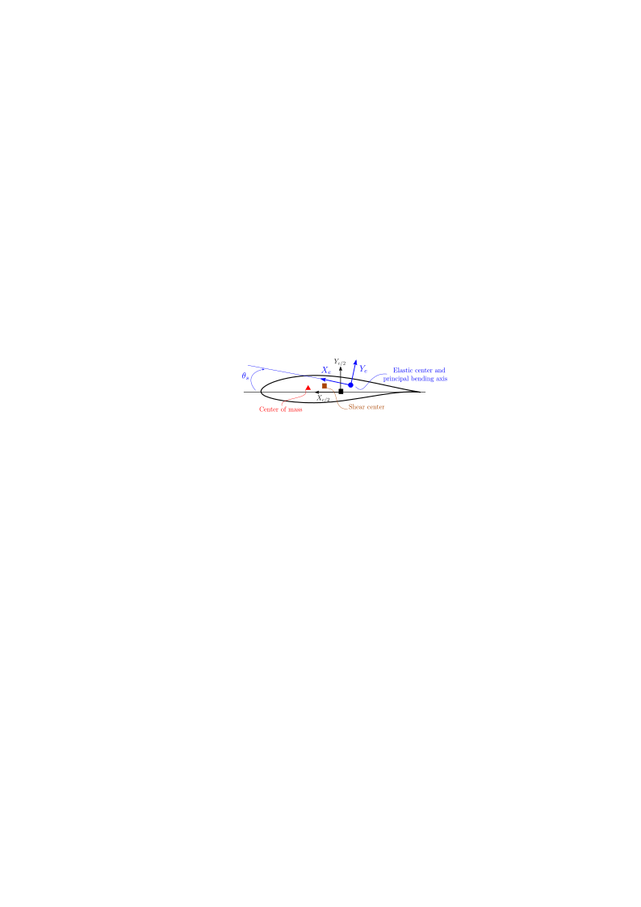

********************************
BLADED to HAWC2 model conversion
********************************

**BLADED** is a tool developed by DNV, and ``wetb`` contains a basic reader that
can interpret a BLADED project file (.prj) and convert the data structures into
an equivalent set of **HAWC2** input files (htc, st, ae, pc).

================================
API and workflow
================================

---------------------------------
Read BLADED project file
---------------------------------

The input from a Bladed model is given in a project file (*prj*) and is formatted
in the XML definition. Within this file the core BLADED inputs are given in the
CDATA field and which according to the XML standards refer to Character Data,
see also `here <https://www.w3resource.com/xml/CDATA-sections.php>`_ and `here
<https://en.wikipedia.org/wiki/CDATA>`_ for a more detailed technical description.
Within the CDATA field a custom BLADED type markup definition is used. The ``wetb``
reader includes an interpreter for this custom BLADED markup and outputs this
data structure to the user as a nested dictionary, and which allows easy access
to all the different key/value pairs defined in the BLADED CDATA field. This
nested dictionary structure is accessible via the variable
``wetb.bladed.readprj.ReadBladedProject.bd``.

Outside the CDATA field the XML data is parsed via the ``lxml`` Python package,
and the entire XML object ``lxml.objectify.fromstring(str)`` is exposed to the user
via the ``wetb.bladed.readprj.ReadBladedProject.xmlroot`` variable.

In ``wetb` the
project file can be read using the following::

     from wetb.bladed.readprj import ReadBladedProject
     prj = ReadBladedProject('my_bladed_project_file.prj')
     # XML object tree (and lxml data object)
     prj.xmlroot
     # CDATA field as nested dictionary
     prj.bd

A convenience function ``wetb.bladed.readprj.ReadBladedProject.get_key`` is also
available to extract a ``numpy`` array, for example as follows::

     from wetb.bladed.readprj import ReadBladedProject
     prj = ReadBladedProject('my_bladed_project_file.prj')
     # the following keys contain a data array
     data_arr = prj.get_key('BSTIFFMB', 'EIFLAP')
     # which is the similar calling (but excludes data conversion to int/float)
     prj.bd['BSTIFFMB']['EIFLAP']
     # if a key contains a section with sub-keys, a dictionary is returned:
     data_dict = prj.get_key('BSTIFFMB')
     # and is similar to
     prj.bd['BSTIFFMB']

---------------------------------
Convert BLADED project file to HAWC2
---------------------------------

The class ``wetb.bladed.prj2hawc.Convert2Hawc`` will convert a Bladed project
file into a set of HAWC2 input files. This process assumes that a standard
3 bladed upwind turbine configuration is used, and a generic HAWC2 `htc template
file  <https://gitlab.windenergy.dtu.dk/toolbox/WindEnergyToolbox/-/blob/master/wetb/bladed/template.htc>`_
serves as the starting point for the conversion process. Note that the converter
class ``wetb.bladed.prj2hawc.Convert2Hawc`` inherits from
``wetb.bladed.readprj.ReadBladedProject``, and hence will first read the Bladed
project file::

    import os
    import urllib.request
    import shutil
    from wetb.bladed.prj2hawc import Convert2Hawc
    # download the htc template file,
    url = 'https://gitlab.windenergy.dtu.dk/toolbox/WindEnergyToolbox/-/'
    url += 'raw/master/wetb/bladed/template.htc'
    fname_tmpl = '/path/to/my/template.htc'
    with urllib.request.urlopen(url) as response, open(fname_tmpl, 'wb') as fout:
        shutil.copyfileobj(response, fout)
    # file name of the Bladed project file
    fprj = '/path/to/my/bladed.prj'
    # initiate the project converter object, will first read the prj file (see above)
    prj = Convert2Hawc(fprj)
    # convert to the HAWC2 formats: htc, ae, pc and st files
    fname_htc = fname_tmpl.replace('template.htc', 'bladed-to-hawc2.htc')
    prj.convert(fname_htc)
    # note that the ae, pc and st files will be saved in the same directory as
    # fname_htc, with .htc replaced by .ae, .pc, .st etc.

================================
Theoretical background
================================

---------------------------------
Coordinate systems
---------------------------------

The coordinate systems used in both codes are different. Note that in HAWC2
coordinate systems of general bodies are defined by the users. However,
the HAWC2 global and blade cross-section coordinate systems are predetermined,
and they differ from Bladed in the following manner:

* Global Bladed *X* axis is positive pointing downwind whereas in HAWC2 the
  global *Y* direction is positive in the downwind direction.

* The HAWC2 global *Z* direction is in the same direction as the gravity vector
  (positive down), while it is the opposite in Bladed (positive up).

* The Bladed cross-section coordinate system is rotated 90 degrees around *Z* wrt HAWC2.

The figures below illustrate clearly the HAWC2 and Bladed coordinate systems.

^^^^^^^^^^^^^^^^^^^^^^^^^^^^^^^^^
Bladed coordinate systems
^^^^^^^^^^^^^^^^^^^^^^^^^^^^^^^^^

   Bladed coordinate system, rotor rotation and radius definition.

   Bladed cross-section structural centers, half chord location and structural pitch definition.

   Bladed airfoil geometric positioning along the blade.

^^^^^^^^^^^^^^^^^^^^^^^^^^^^^^^^^
HAWC2 coordinate systems
^^^^^^^^^^^^^^^^^^^^^^^^^^^^^^^^^

    HAWC2 global, tower, shaft, hub, blade-i and meteorological coordinate systems.

    HAWC2 cross-section structural centers, half chord location and structural pitch definition.

    HAWC2 airfoil positioning in blade body coordinates and aerodynamic pitch given as in the *htc* file *c2_def* section.

---------------------------------
Cross-sectional parameters
---------------------------------

Bladed uses isotropic material definitions for all bodies and for the HAWC2
conversion the same isotropic assumption is used. Since the HAWC2 *st* file definition
splits the Young's (*E*) and shear modulus (*G*) from the actual stiffness terms, and Bladed
defines the actual stiffness values (meaning the product of *EI* etc), the
corresponding HAWC2 *st* input simply assumes a value for *E* and *G*, and
specifies the inertia such that the product (i.e. stiffness) is correct.

Bladed defines a mass polar moment of inertia in combination with the ratio
between the mass radii of gyration around the airfoil's center of mass, while
in HAWC2 the radii of gyration in *X* and *Y* direction are given wrt the elastic
center.

---------------------------------
References
---------------------------------

[1] `HAWC2 User Manual v12.8 <http://tools.windenergy.dtu.dk/HAWC2/manual/>`_

[2] Bladed 4.6 Manual

